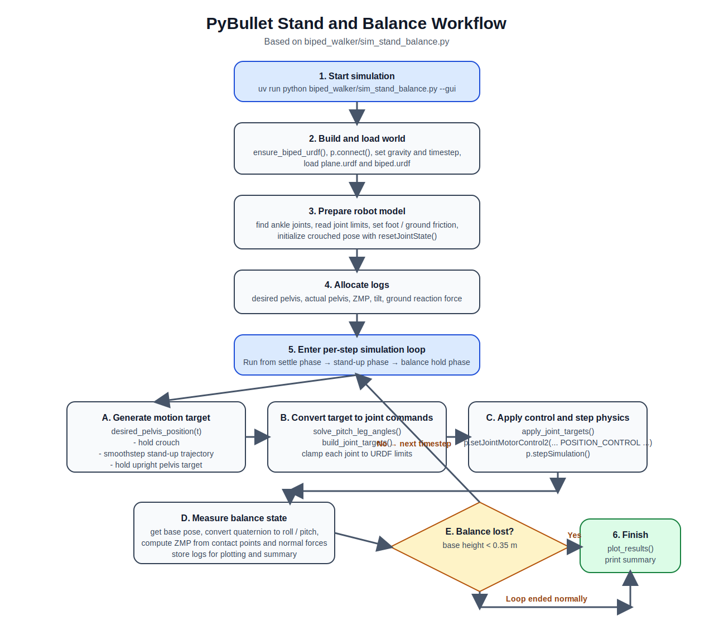

# Biped Stand-Up and Balance Demo Notes

This note captures the main ideas behind the `biped_walker/sim_stand_balance.py` demo and the key discussion points around standing, balancing, and interpreting the result plot.

## Workflow overview

The workflow above shows the actual structure used in the demo:

1. initialize the PyBullet world and load the URDF
2. generate a desired pelvis trajectory from crouch to standing
3. convert that pelvis target into leg joint targets
4. apply `POSITION_CONTROL` each simulation step
5. read body state and contact data to monitor balance
6. stop on loss of balance or finish normally, then plot and summarize the run

## What the demo does

The demo uses the simplified biped URDF in `biped_walker/biped.urdf` and simulates:

1. starting from a **crouched double-support pose**
2. rising through a **smooth stand-up trajectory**
3. holding a stable **upright standing posture**

It is a **simple simulation demo**, not a real-world balance controller.

## Why fixed feet alone are not enough

Keeping both feet fixed on the ground only defines the contact constraint. It does **not** tell the robot:

- how the pelvis should move upward
- what hip, knee, and ankle angles should change
- how to move from crouch to standing without violating joint limits

To stand up successfully, the robot still needs:

1. a **body motion plan**
2. a way to convert that motion into **joint targets**

In this demo:

- the **pelvis trajectory** gives the motion plan
- the **analytic IK** gives the matching leg joint angles

## Why use a crouch-to-stand trajectory

Standing up is a transition, not just a static posture. A crouch-to-stand pelvis trajectory is used because it:

- provides a smooth vertical rise
- avoids sudden jumps in commanded posture
- keeps the stand-up motion physically interpretable
- makes it easier to stay inside feasible leg geometry

Without that trajectory, the robot would only know the initial pose and final pose, but not how to move between them.

## Why use IK

Once the feet are constrained on the ground and the pelvis is asked to move, the simulator still needs to know which joint angles achieve that configuration.

IK is used to convert:

- **desired pelvis position**
- **fixed foot positions**

into:

- **hip pitch**
- **knee**
- **ankle**

commands for each leg.

In this demo, the online PyBullet multi-end-effector IK path was replaced with a simpler **analytic planar leg IK**, because it was more stable for this URDF and avoided a PyBullet crash.

## What “nominal standing pose” means

A **nominal standing pose** is the robot’s default upright balanced posture:

- both feet flat on the ground
- pelvis centered over the support region
- torso nearly upright
- joints in comfortable ranges, not near limits

It is the usual reference posture for standing and walking controllers.

## Crouch pose vs squat pose

These are similar, but usually differ by depth and purpose:

| Pose | Meaning |
|---|---|
| **Crouch** | A moderately lowered posture with bent knees and hips; often used as a ready or transition pose. |
| **Squat** | A deeper lowered posture with larger knee and hip flexion; often more demanding and closer to limits. |

For this demo, the initial posture is closer to a **crouch** than a deep squat.

## Common initial conditions in robotics

For standing and walking experiments, the most common initial condition is:

- **nominal standing**

or, when testing a stand-up motion:

- **a valid crouched ground-contact pose**

It is much more common than:

- **dropping the robot in the air**

Dropping in the air adds impact, landing transients, and extra contact uncertainty, which makes it harder to isolate the actual standing controller behavior.

## Can a robot stay balanced if all joints are locked?

Usually **no**, at least not robustly.

If a robot is already in a perfectly stable standing pose, locking the joints may let it remain upright for a while in an ideal simulation. But in general, that is not enough because:

1. tiny disturbances can start a fall
2. model and contact errors always exist
3. locked joints cannot actively recover once the body tips

What often looks like “locking” in simulation is actually **active posture holding**:

- the controller keeps sending the same target joint positions
- the motors continue applying torque to maintain the pose

That is what this demo does.

## How balance is maintained in this demo

After stand-up, the demo does **not** run a full balance controller such as ZMP control, LQR, MPC, or whole-body control.

Instead, it keeps balance by:

1. maintaining **double support**
2. keeping both feet fixed on the ground
3. commanding a **symmetric upright leg posture**
4. using PyBullet **POSITION_CONTROL** to hold the joint targets every simulation step

So the demo is best described as:

- **stable posture holding**

rather than:

- **disturbance-rejecting balance control**

## Why this is a simplified, idealized demo

The demo is useful for understanding stand-up geometry and motion generation, but it is not a real-world-grade standing controller.

It simplifies or omits:

1. IMU and foot force sensing
2. state estimation
3. CoM/CoP/ZMP feedback regulation
4. disturbance rejection
5. uneven terrain, slip, compliance, and modeling mismatch
6. full-body whole-body control

So this is a good educational and debugging baseline, but not a robust real robot solution by itself.

## How to read `standup_balance_results.png`

The output figure is a 4-panel summary of whether the stand-up motion was physically sensible and stable.

### 1. Stand-up Height

Shows:

- desired pelvis height
- actual pelvis height

Why it matters:

- tells whether the robot followed the commanded upward motion
- reveals lag, overshoot, collapse, or poor tracking

What to look for:

- smooth rising curve
- actual height close to desired height

### 2. Balance in Support Area

Shows:

- pelvis motion in the horizontal plane
- ZMP trace
- foot support rectangles

Why it matters:

- indicates whether support remains reasonable during standing
- helps check whether the robot stays centered over its base of support

Important note:

In double support, the true support region is the **combined support polygon / convex hull of both feet**, not each foot rectangle individually.

### 3. Base Tilt

Shows:

- roll angle
- pitch angle

Why it matters:

- tells whether the robot remained upright
- large spikes usually mean rocking, instability, or falling

What to look for:

- small angles
- quick settling after any transient

### 4. Ground Reaction Force

Shows:

- total vertical contact force from the ground

Why it matters:

- confirms that the feet are supporting the robot
- highlights loss of contact or impact transients

What to look for:

- positive force while standing
- a smooth settled value after startup

## Comments on the current result

The current result is good for this simplified demo.

### Positive signs

1. **Smooth stand-up**
   - the pelvis rises cleanly without collapse

2. **Small tilt**
   - roll and pitch stay very small after settling

3. **Reasonable support behavior**
   - the ZMP remains in a sensible region for double support

4. **Correct force scale**
   - the settled vertical force is in the expected range for the robot mass

### Main imperfection

The main mismatch is that:

- the **actual pelvis height ends slightly above the desired pelvis height**

This likely comes from the difference between:

- the pelvis target used in the leg geometry
- the floating base position reported by PyBullet

That is acceptable for this demo, but it would be a natural next refinement if tighter tracking were needed.

## Reasonable next improvements

The following three improvements would make the demo analysis clearer and the motion more informative:

### 1. Improve pelvis height consistency

Goal:

- reduce the mismatch between desired pelvis height and actual pelvis height

Why it matters:

- it would make the stand-up motion more geometrically consistent
- it would separate true tracking error from coordinate-definition mismatch

Possible directions:

- refine the standing target used by the analytic leg IK
- account more carefully for how PyBullet reports the floating base position
- tune the final pelvis target so the logged height better matches the intended posture

### 2. Plot the true double-support polygon

Goal:

- visualize the actual combined support region rather than only the two separate foot rectangles

Why it matters:

- in double support, stability should be judged against the combined support polygon / convex hull of both feet
- this would make the ZMP plot easier to interpret and less visually misleading

Possible directions:

- draw the convex hull around the full left and right foot contact areas
- highlight whether each ZMP sample is inside or outside that polygon

### 3. Split total ground reaction force into left and right foot forces

Goal:

- show how load is distributed between the two feet during and after stand-up

Why it matters:

- total vertical force only tells whether the robot is supported overall
- left/right force traces would reveal weight transfer, asymmetry, and whether one foot is unloading unexpectedly

Possible directions:

- accumulate contact forces separately for the left foot and right foot links
- add a plot for left force, right force, and optionally force ratio

## Most important takeaway

This demo succeeds because it combines:

1. a valid initial crouched contact pose
2. a smooth stand-up trajectory
3. feasible leg kinematics
4. symmetric double support
5. active posture holding with position-controlled joints

It does **not** prove robust real-world balancing. It demonstrates a clean and understandable simulation path from crouch to stable standing.
