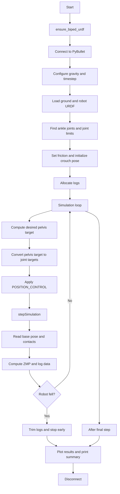

# PyBullet Stand and Balance Workflow

This document is a standalone workflow guide for `biped_walker/sim_stand_balance.py`.

It expands the SVG diagram with the control and data-flow details that are easy to miss in a compact figure.

## Entry point

Run the demo with UV so the project environment is used correctly:

```bash
uv run python biped_walker/sim_stand_balance.py --gui
```

If `--gui` is omitted, the script runs in `p.DIRECT` mode.

## High-level workflow



## Detailed execution flow

## 1. Prepare the robot description

The script starts by calling `ensure_biped_urdf()`.

- If `biped_walker/biped.urdf` already exists, it uses it directly.
- Otherwise it calls `create_biped_urdf(URDF_PATH)` to generate it.

This keeps the simulation self-contained: the script can regenerate the simplified robot model if needed.

## 2. Connect to PyBullet and configure the world

The script connects with:

- `p.GUI` when `--gui` is passed
- `p.DIRECT` otherwise

It then configures the simulation world:

- adds the standard PyBullet asset path with `pybullet_data.getDataPath()`
- sets gravity to `-9.81 m/s^2`
- sets a fixed timestep `SIM_DT = 1/240`
- increases solver iterations for more stable contact handling

This is the basic PyBullet setup phase before any bodies are loaded.

## 3. Load the ground and biped

Two URDFs are loaded:

1. `plane.urdf` as the ground
2. `biped.urdf` as the floating-base robot

The robot base is initialized near the crouched pelvis position:

- base position = `PELVIS_CROUCH`
- base orientation = zero roll/pitch/yaw
- `useFixedBase=False`

Even though the base is free, the robot is expected to remain supported by double foot contact with the ground.

## 4. Discover model information needed for control

Before the control loop starts, the script queries the model for:

- the left ankle joint index
- the right ankle joint index
- the lower and upper joint limits for every actuated joint

Those limits are later used to clamp commanded angles so the target pose remains feasible for the URDF.

## 5. Set contact properties

The script increases friction for:

- the ground
- the left foot link
- the right foot link

This is important because the demo assumes the feet can stay planted during the stand-up motion. Better friction reduces slipping and makes the simple posture-hold strategy more reliable.

## 6. Initialize the crouched pose

The script computes a consistent crouched configuration with:

- `build_joint_targets(PELVIS_CROUCH, ...)`

That function internally:

1. calls `solve_pitch_leg_angles()` to compute planar leg angles from pelvis and foot geometry
2. builds symmetric left/right joint targets
3. clamps the targets to joint limits

The resulting crouch pose is written directly into the robot state using `p.resetJointState(...)`.

This step is important because it gives the simulation a valid starting posture before active control begins.

## 7. Allocate logging buffers

The script allocates arrays for:

- desired pelvis position
- actual pelvis position
- ZMP estimate
- total vertical contact force
- base roll and pitch

These logs are later used both for plotting and for summary statistics.

## 8. Run the simulation loop

The total simulated duration is:

- `SETTLE_TIME`
- `STANDUP_TIME`
- `BALANCE_TIME`

At every timestep, the script performs the same control cycle.

### 8.1 Generate the desired pelvis motion

`desired_pelvis_position(sim_time)` defines a piecewise reference:

1. **settle phase**: hold `PELVIS_CROUCH`
2. **stand-up phase**: smoothly interpolate from crouch to stand with `smoothstep`
3. **balance phase**: hold `PELVIS_STAND`

So the main commanded motion is not a torque policy or a full-body planner. It is a simple pelvis reference trajectory.

### 8.2 Convert pelvis target into leg joint targets

The script uses `build_joint_targets(...)` to convert the desired pelvis position into joint commands.

Inside this step:

- `solve_pitch_leg_angles()` solves a 2-link planar leg geometry problem
- hip roll is fixed at zero
- the same pitch/knee/ankle structure is used for both legs
- all values are clipped to the joint limits from the URDF

This is effectively a small analytic IK layer customized for this simplified biped.

### 8.3 Apply motor commands

The joint targets are sent with `p.setJointMotorControl2(...)` using:

- `controlMode = p.POSITION_CONTROL`
- force and gain values defined near the top of the file

This means the script is using PyBullet's built-in position servo behavior rather than directly commanding torques.

### 8.4 Step the physics engine

After targets are applied, the script advances the simulation with:

```python
p.stepSimulation()
```

This is where PyBullet integrates dynamics, resolves contacts, and updates the robot state.

### 8.5 Read the resulting robot state

After the step, the script reads:

- base position
- base orientation
- roll and pitch from the base quaternion

These values are used to monitor whether the robot remains upright during and after standing up.

### 8.6 Estimate balance from contacts

The script calls `compute_zmp_from_contacts(...)`.

This function:

- collects contact points between robot and ground
- reads the contact position of each point
- reads the normal force at each point
- computes the force-weighted average contact location

That weighted contact point is used as a simple ZMP-like estimate in the support region.

If there is effectively no vertical support force, the function returns `NaN` for the ZMP coordinates.

### 8.7 Log everything

For every timestep, the script stores:

- desired pelvis target
- actual pelvis position
- ZMP estimate
- total vertical force
- base roll and pitch

This makes it possible to inspect both motion tracking and contact behavior after the run finishes.

### 8.8 Detect a fall

The script uses a very simple failure condition:

- if the base height drops below `0.35 m`, it assumes balance is lost

When that happens, it:

1. prints a warning
2. truncates all logs to the failure time
3. exits the simulation loop early

So the script does not try to recover from a fall. It only detects the failure and stops collecting further data.

## 9. Plot the results

At the end, `plot_results(...)` creates a four-panel figure:

1. desired vs actual pelvis height
2. pelvis path and ZMP in the horizontal plane
3. base roll and pitch
4. total vertical contact force

The figure is saved to:

`biped_walker/standup_balance_results.png`

## 10. Print summary metrics

The script then prints compact summary values:

- final pelvis height
- maximum absolute roll
- maximum absolute pitch
- RMS ZMP distance from a nominal support center

These summary numbers are a quick way to judge whether the motion stayed upright and reasonably centered.

## 11. Disconnect cleanly

Finally, the script disconnects from PyBullet in a `finally` block.

That ensures the client is closed even if the simulation exits early because of a failure or another exception.

## What PyBullet is doing in this demo

PyBullet is responsible for:

- rigid-body dynamics integration
- joint motor actuation through `POSITION_CONTROL`
- collision detection
- contact force generation
- reporting contact data and body pose

The script is responsible for:

- generating the stand-up reference motion
- converting pelvis motion into leg joint targets
- deciding what quantities to log
- deciding what counts as loss of balance

So the demo is best understood as:

- **reference trajectory generation + simple analytic IK + PyBullet position control + contact-based monitoring**

rather than:

- **a full feedback balance controller**

## Important limitation

This workflow does **not** implement disturbance-rejecting balance control.

It does not include:

- IMU-based stabilization
- CoM feedback regulation
- whole-body control
- torque optimization
- active recovery from pushes

Instead, it shows a minimal and readable way to use PyBullet to:

1. load a biped
2. command a crouch-to-stand motion
3. hold an upright posture
4. inspect whether contact and body motion stayed reasonable
