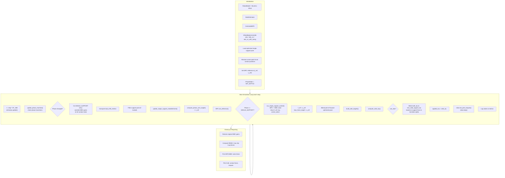
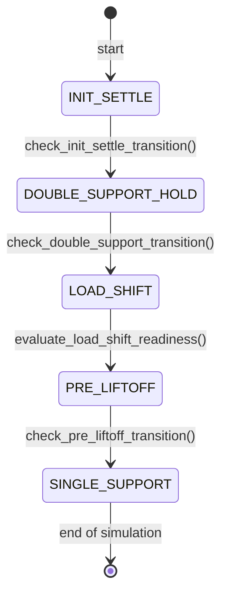
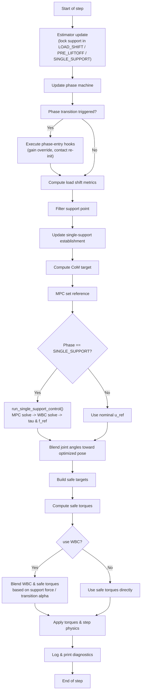
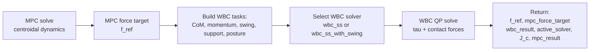
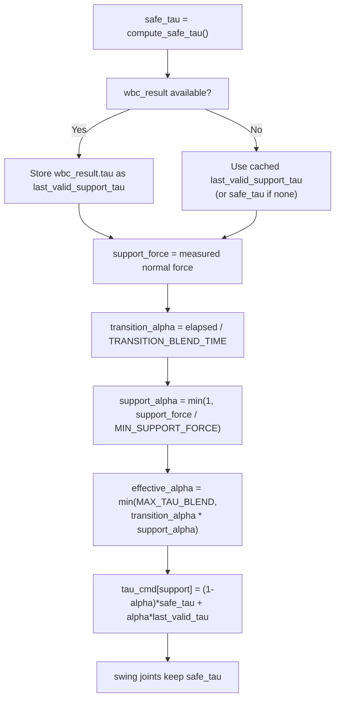

# Control Flow Diagram — `main.py`

## High-Level Architecture

---

## Phase State Machine

---

## Single Iteration Detail

---

## `run_single_support_control()` Breakdown

---

## Torque Blending Logic (SINGLE_SUPPORT)

